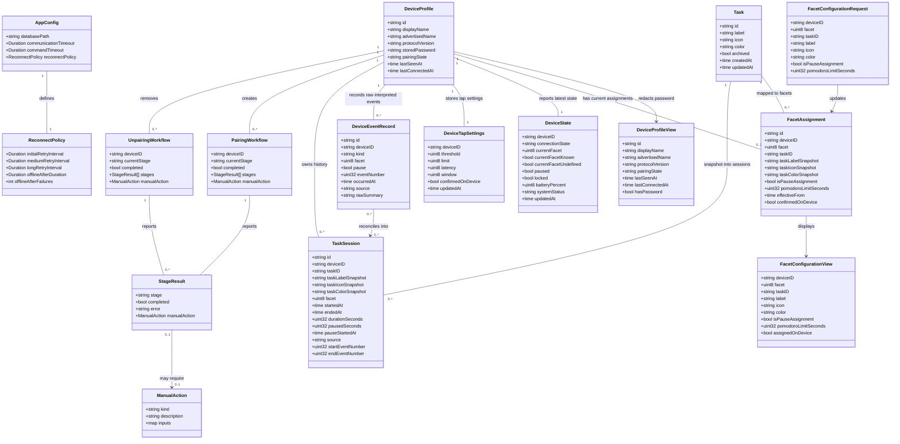

# TimeFlip2 Desktop Application

## Requirements
Implement a Mac-first, cloud-independent desktop application for TimeFlip2 that uses the existing Go BLE library to pair, connect, configure, track, and review task sessions locally.

Create a dependable desktop experience where a user can discover and pair a TimeFlip2 device, assign local tasks to facets, see current tracking state, pause/unpause tracking, configure supported device settings, import activity history as task sessions, and reconnect automatically while the app remains open.

Preserve a clear boundary between device-backed state and app-owned state: `timeflip-go` owns BLE protocol interaction, while this desktop app owns local configuration, labels, icons, stored TimeFlip passwords, task assignments, task-session history, and user-facing interpretation.

Limit the first implementation to macOS-focused development, local SQLite persistence, Wails-based desktop UI, and no cloud APIs, installer work, startup daemon behaviour, notifications, or Windows/Linux runtime implementation.

## Entities

## Approach
1. Desktop Product Architecture:
   - Use Wails as the desktop application shell, with Go owning device, persistence, tracking, and application services, and the frontend owning interactive views and user workflow presentation.
   - Keep the first screen as the usable application surface, not a landing page: show device status, current task/session state, facet assignments, and primary connect/pair actions.
   - Treat the Wails v3 system tray menu as the control-centre surface that mirrors active task and connection state, opens a normal foreground app window, refreshes state, and toggles pause/resume for the active device.

2. Device Integration:
   - Consume `github.com/mitchellrj/timeflip-go` as the device integration boundary and use its macOS transport for BLE scanning, pairing, connection, authorization, state reads, configuration writes, history reads, and event streaming.
   - Wrap `timeflip-go` in app-owned service interfaces so UI and persistence code never depend directly on raw BLE session objects.
   - Store TimeFlip passwords in local app configuration for the initial implementation, use them for automatic authorization, and redact them in logs and diagnostics.
   - Support an explicit `--trace-ble PATH` diagnostic flag that wraps the transport and writes raw BLE operations for hardware debugging; this trace is opt-in and may include password bytes.

3. Local Persistence:
   - Use SQLite for device profiles, tasks, facet assignments, app settings, device event records, task sessions, and history reconciliation checkpoints.
   - Version schema changes through migrations stored in the repository and executed at app startup before services are used.
   - Preserve history by snapshotting the task assignment into each task session so future facet reassignment affects only new records.

4. Tracking and History:
   - Convert low-level device facet, pause, double-tap, history, and reconnect signals into user-facing `DeviceState`, `DeviceEventRecord`, and `TaskSession` records.
   - Start with task sessions as the only history view; defer summary reporting, statistics, editable time entries, and export workflows until session history is reliable.
   - Represent a pause side as a local facet assignment whose active state pauses the open task session, accumulates `pausedSeconds`, and resumes the same task session when returning to a work facet.
   - Import device history on startup/connect before interpreting the current live state, merge it idempotently with stored events, and reflect imported sessions in the UI.

5. Error Handling and Recovery:
   - Map library errors, manual OS actions, Bluetooth permission issues, wrong passwords, timeouts, unsupported operations, and readback mismatches into user-facing recovery states.
   - Use stage-based pairing and unpairing presentation, preserving partial progress and manual-action instructions returned by the library.
   - Use the default reconnection policy: scan immediately after launch or disconnect, retry every 15 seconds for 2 minutes, every 60 seconds until 15 minutes, then every 5 minutes while the app is open; mark a device offline after 3 consecutive failures or 2 minutes without success.
   - Treat the facet characteristic (`F1196F52`) as authoritative for current facet changes; ignore promoted text-side facet events from `F1196F51` when they would otherwise roll back state.

## Structure

### Inheritance Relationships
1. `DeviceClient` interface defines scan, pair, unpair, connect, read, write, history, and event-stream contracts used by app services.
2. `TimeflipDeviceClient` implements `DeviceClient` by delegating to `timeflip-go` client, session, and macOS transport objects.
3. `Store` interface defines transactional persistence contracts for device profiles, app config, tasks, assignments, events, sessions, and migrations.
4. `SQLiteStore` implements `Store` using SQLite and schema migrations.
5. `Clock` interface defines current time for tracking and tests; `SystemClock` implements real wall-clock time.
6. `EventBus` interface defines app state publication from Go services to the Wails frontend; `WailsEventBus` implements it using Wails runtime events.
7. `AppError` struct provides domain-classified error codes, safe user messages, redacted diagnostic messages, and wrapped causes.
8. `DeviceWorkflowError`, `PersistenceError`, `ValidationError`, and `TrackingError` classify failures by responsibility area and map to `AppError`.

### Dependencies
1. Wails frontend calls `AppController` methods exposed from the Go backend.
2. `AppController` depends on `DeviceService`, `ConfigService`, `TaskService`, `TrackingService`, and `HistoryService`.
3. `DeviceService` depends on `DeviceClient`, `Store`, `EventBus`, `Clock`, and `ConfigService`.
4. `ConnectionManager` depends on `DeviceClient`, `Store`, `TrackingService`, `HistoryService`, `EventBus`, `Clock`, and reconnect timers.
5. `TaskService` depends on `Store` and validates task and facet assignment changes.
6. `TrackingService` depends on `Store` and converts device state/events into active task-session changes.
7. `HistoryService` depends on `Store`, `DeviceClient`, and `TrackingService` to import device history and reconcile it into sessions.
8. The system tray control centre depends on `AppController`, Wails system tray menus, Wails events, and the main app window to mirror state and expose quick actions.
9. `SQLiteStore` depends only on the SQLite driver, migration files, context, and logger.
10. Frontend view components depend on backend DTOs and Wails bindings, not on SQLite or `timeflip-go` types.
11. `traceLogger`, `tracingTransport`, and `tracingConnection` wrap the native transport only when `--trace-ble` is supplied.

### Layered Architecture
1. Desktop Shell Layer: Wails bootstrap, window lifecycle, system tray setup, frontend asset binding, and application startup/shutdown.
2. Controller/API Layer: Go methods exposed to Wails for scanning, pairing, unpairing, configuring facets, reading state, controlling pause, reading history, and saving settings.
3. Application Service Layer: device orchestration, connection management, task assignment, tracking interpretation, history reconciliation, and system tray state.
4. Domain Layer: app-owned entities, value objects, validation rules, session-boundary rules, and error classifications.
5. Device Adapter Layer: `timeflip-go` client/session wrapper, macOS transport construction, library result mapping, and redacted diagnostics.
6. Persistence Layer: SQLite store, migrations, transaction boundaries, idempotency constraints, and repository-style methods.
7. Frontend Presentation Layer: app layout, device list, pairing/unpairing wizard, current-state dashboard, facet editor, history task-session list, settings, and system tray affordances.
8. Test Layer: domain/service unit tests with fake stores and fake device clients, SQLite integration tests, frontend interaction tests where practical, and optional hardware smoke-test documentation.
9. Diagnostics Layer: opt-in BLE operation tracing with an explicit CLI flag and warnings that trace output includes raw payload bytes.

## Operations

### Create Project Foundation - Go, Wails, Scripts, and Module Metadata
1. Responsibility: Turn the scaffold into a buildable Go desktop project consistent with the existing CI and pre-commit configuration.
2. Attributes:
   - `modulePath`: string - Go module path for the desktop application.
   - `wailsConfig`: file - Wails application configuration.
   - `frontendPackage`: file - frontend package manifest and scripts.
   - `options`: struct - command-line options including `--trace-ble` for raw BLE tracing.
3. Methods:
   - Initialize the root Go module with dependencies for Wails, SQLite, `timeflip-go`, and test support.
   - Add Wails application entrypoint and app bootstrap with backend service construction.
   - Parse CLI options before app bootstrap and pass optional BLE trace writer into native device client construction.
   - Add missing `scripts/dev/go-quality.sh`, `scripts/dev/go-fuzz-smoke.sh`, `scripts/dev/pre-commit-go.sh`, and `scripts/dev/pre-commit-shell.sh` so current hooks and CI invoke real commands.
   - Ensure `go test ./...`, `go vet ./...`, `go mod tidy`, formatting, and linting are represented by local scripts.
4. Constraints:
   - Do not remove existing CI, lint, pre-commit, Dependabot, or license files.
   - Keep generated Wails bindings and frontend build outputs deterministic; if committed, refresh them only through project scripts/build commands.
   - Make Linux CI able to compile non-macOS-safe packages using build tags or adapter boundaries even though runtime BLE support is macOS first.

### Create Domain Models - Device, Task, Facet, State, Events, Sessions
1. Responsibility: Define app-owned domain types without leaking raw `timeflip-go` session objects into controllers or frontend DTOs.
2. Attributes:
   - `DeviceProfile`: stores stable device identity, display names, protocol preference, pairing state, stored password, timestamps, and status metadata.
   - `DeviceProfileView`: exposes display-safe device profile fields and `hasPassword` without exposing `storedPassword`.
   - `Task`: stores local label, icon, colour, archive state, and creation/update timestamps.
   - `FacetAssignment`: maps a device facet to a task, snapshots task label/icon/colour, stores optional Pomodoro limit, pause-side intent, effective timestamp, and device confirmation status.
   - `DeviceState`: stores current connection, facet, known/undefined facet state, pause, lock, battery, system, and update state.
   - `DeviceTapSettings`: stores local tap threshold, limit, latency, window, confirmation status, and update timestamp per device.
   - `DeviceEventRecord`: stores normalized raw/interpreted device events for idempotent history reconciliation.
   - `TaskSession`: stores interpreted work intervals with task assignment snapshot, pause duration, open pause start, and source event boundaries.
3. Methods:
   - `ValidateDeviceProfile(profile)`: ensure device ID is present and password length is either empty or six characters.
   - `ValidateTask(task)`: ensure label is present, icon is optional but bounded, and colour is a valid app colour value.
   - `ValidateFacetAssignment(assignment)`: ensure facet is in the TimeFlip2 range, pause assignment and task assignment are coherent, and Pomodoro duration is non-negative.
   - `StartTaskSession(deviceID, assignment, event)`: create a new session snapshot from the active assignment.
   - `EndTaskSession(session, eventOrTime)`: close a running session with a non-negative duration.
   - `DefaultDeviceTapSettings(deviceID)`: provide sensible local tap defaults of threshold 20, limit 10, latency 5, and window 30.
4. Constraints:
   - Labels and icons are local-only and are never sent to `timeflip-go`.
   - Facet reassignment only changes future records; existing `TaskSession` rows must retain their task snapshot.
   - A pause-side assignment must pause the active task session rather than creating a normal task session while active.

### Implement Persistence Layer - SQLite Store and Migrations
1. Interface Definition: `Store` defines migration, transaction, and repository-style methods for all app-owned entities.
2. Core Methods:
   - `Migrate(ctx)`: applies ordered schema migrations exactly once.
   - `SaveDeviceProfile(ctx, profile)`: upserts a known device profile and redacts password values from logs.
   - `GetDeviceProfile(ctx, deviceID)`: returns a stored profile or a not-found error.
   - `ListDeviceProfiles(ctx)`: returns known devices ordered by last-seen or display name.
   - `SaveTask(ctx, task)`, `ListTasks(ctx, includeArchived)`, `ArchiveTask(ctx, taskID)`: manage local task catalogue.
   - `SaveFacetAssignment(ctx, assignment)`, `ListFacetAssignments(ctx, deviceID)`: persist current/future facet mappings.
   - `SaveDeviceState(ctx, state)`, `GetDeviceState(ctx, deviceID)`: persist latest state for dashboard and system tray startup display.
   - `SaveDeviceTapSettings(ctx, settings)`, `GetDeviceTapSettings(ctx, deviceID)`, `ListDeviceTapSettings(ctx)`: persist per-device tap configuration and confirmation status.
   - `InsertDeviceEvent(ctx, event)`: insert idempotently by device ID, event number where present, kind, and occurrence timestamp.
   - `ListDeviceEvents(ctx, deviceID)`: returns stored events for idempotent history merge and reconciliation checks.
   - `SaveTaskSession(ctx, session)`, `ListTaskSessions(ctx, filter)`, `GetOpenTaskSession(ctx, deviceID)`: manage interpreted history.
   - `SaveConfig(ctx, config)`, `LoadConfig(ctx)`: persist app settings including reconnect policy and stored passwords in the initial app-config model.
3. Transaction Management:
   - Use transactions for assignment changes that close/open sessions.
   - Use transactions for history import batches so event records and task sessions remain consistent.
4. Constraints:
   - Schema must include uniqueness constraints for idempotent event/history imports.
   - Schema must store task-session pause totals and open pause start time so active sessions can count up accurately in the UI.
   - Migration tests must run against an empty database and a second migration pass.
   - Stored passwords must never be printed in migration, query, or error logs.

### Implement Device Adapter - TimeflipDeviceClient
1. Interface Definition: `DeviceClient` abstracts all calls to `timeflip-go` needed by the desktop app.
2. Core Methods:
   - `Scan(ctx, includeUnsupported)`: returns supported device candidates and unsupported entries when requested.
   - `Pair(ctx, request)`: calls the library staged pair flow and maps stage results, completion, and manual action into app DTOs.
   - `Unpair(ctx, request)`: calls the library staged unpair flow and maps offline/manual-action outcomes.
   - `Connect(ctx, deviceID, advertisedName, protocolVersion)`: opens a session and returns an app-owned connection handle.
   - `Authorize(ctx, handle, password)`: authorizes using the stored app-config password or explicit pairing password.
   - `ReadDeviceSnapshot(ctx, handle)`: reads info, battery, system state where supported, tracker status, task parameters for facets, and tap settings.
   - `WriteFacetConfiguration(ctx, handle, assignment)`: writes supported device-backed colour, task parameters, and Pomodoro values, then requests readback.
   - `SetPause(ctx, handle, enabled)`, `SetLock(ctx, handle, enabled)`, `SetAutoPause(ctx, handle, minutes)`, `SetTapSettings(ctx, handle, settings)`: map app controls to library commands.
   - `ReadHistory(ctx, handle, request)`: imports device history entries from the configured start point.
   - `Events(ctx, handle)`: starts technical event streaming and returns app-normalized event and error channels.
   - `Close(ctx, handle)`: closes active session and stops associated streams.
   - `NewTracingTransport(inner, writer)`: optionally wraps native transport calls and records connect/read/write/notify/result events for hardware debugging.
3. Exception Handling:
   - Map timeouts to retryable device errors.
   - Map authorization failure to a password/action-required error.
   - Map unsupported OS pair/unpair to manual-action status instead of a fatal application error.
   - Redact password values and raw password characteristic bytes from diagnostics.
   - Preserve raw BLE trace output only when explicitly requested; callers must treat trace files as sensitive because password bytes may be present.
4. Constraints:
   - Only this adapter may import `github.com/mitchellrj/timeflip-go` packages.
   - Adapter tests should use fake device clients or fake library transports where available; CI must not require physical BLE hardware.
   - App tracking must not trust text-side facet notifications from `F1196F51` over authoritative facet notifications from `F1196F52`.

### Implement Device Service - Pairing, Unpairing, Configuration, and State Reads
1. Interface Definition: `DeviceService` exposes user-facing workflows independent of Wails or frontend details.
2. Core Methods:
   - `ListDevices(ctx)`: scans for TimeFlip2 devices, records last-seen metadata for known devices, and returns UI-ready device cards.
   - `PairDevice(ctx, deviceID, password, newPassword, allowOSPairing)`: runs staged pairing, stores or updates the device profile, stores the chosen password in app config, and emits workflow-state events.
   - `UnpairDevice(ctx, deviceID, factoryReset, allowOSUnpairing)`: runs staged unpairing and marks or removes the device profile according to completed/manual-action state.
   - `RefreshDeviceState(ctx, deviceID)`: connects/uses active session, authorizes with stored password, reads current device state, saves it, and emits frontend/system tray updates.
   - `ConfigureFacet(ctx, request)`: persists local assignment, writes supported device-backed values when connected, verifies readback where possible, and returns current facet view.
   - `ConfigureTapPause(ctx, request)`: updates tap, pause, auto-pause, or pause-side assignment according to the selected control.
   - `ConfigureTapSettings(ctx, settings)`: persists tap threshold/limit/latency/window, writes them to an active device when possible, and marks confirmation state.
   - `SetPaused(ctx, deviceID, paused)`: writes pause state to the device when connected and updates tracking interpretation.
   - `ConnectDevice(ctx, deviceID)`: connects, authorizes, applies unconfirmed stored tap settings, imports device history, reads current snapshot, and starts the event stream.
   - `DisconnectDevice(ctx, deviceID)`: stops event streaming, closes the handle, removes cached connection state, and marks the device disconnected.
3. Dependency Injection:
   - Depends on `DeviceClient`, `Store`, `TaskService`, `TrackingService`, `HistoryService`, `EventBus`, and `Clock`.
4. Transaction Management:
   - Persist local assignment changes before device writes, then mark device confirmation status after readback.
   - Use compensating status rather than deleting local assignments if device readback fails.
5. Constraints:
   - Pairing and unpairing must expose all library stages and manual actions.
   - Configuration requests must distinguish local-only labels/icons from device-backed colour/task/Pomodoro values.
   - Event streaming must ignore promoted text facet events from the TimeFlip events characteristic and process only authoritative facet/history/tap tracking events.

### Implement Connection Manager - Automatic Reconnect and Event Stream Lifecycle
1. Responsibility: Keep configured devices connected while the app is open without promising startup daemon behaviour.
2. Attributes:
   - `failureCounts`: map - consecutive failed reconnect attempts per device.
   - `firstFailure`: map - first failure timestamp per device for elapsed threshold handling.
   - `retryState`: map - current retry cadence per device.
   - `cancel`: context cancellation function for all reconnect loops.
3. Methods:
   - `Start(ctx)`: loads known paired devices and begins immediate scan/reconnect attempts.
   - `ConnectDevice(ctx, deviceID)`: connects, authorizes using stored password, reads initial state, imports history, and starts event stream.
   - `HandleDisconnect(deviceID, reason)`: closes stale handles, marks device reconnecting/offline as appropriate, and schedules retry.
   - `ScheduleReconnect(deviceID)`: applies the default cadence of 15 seconds, 60 seconds, and 5 minutes according to elapsed reconnect time.
   - `MarkOfflineIfThresholdReached(deviceID)`: marks offline after 3 consecutive failures or 2 minutes without successful reconnect.
   - `Stop(ctx)`: cancels reconnect loops; device service owns per-session event stream cleanup.
4. Constraints:
   - Prevent duplicate active sessions for one device.
   - Never run overlapping history imports for one device.
   - Retry only while the app is open.
   - Emit state changes for every user-visible transition: connecting, authorizing, connected, reconnecting, offline, error, and manual action required.
   - Continue lightweight health reconnect attempts after a successful connection so sleep/wake or stale handles are corrected while the app stays open.

### Implement Tracking Service - State Interpretation and Task Session Boundaries
1. Interface Definition: `TrackingService` converts device state and events into user-facing active task and task-session history.
2. Core Methods:
   - `ApplyDeviceSnapshot(ctx, snapshot)`: updates latest state and opens/closes sessions if current facet or pause state changed.
   - `ApplyDeviceEvent(ctx, event)`: records event idempotently, ignores non-tracking events for session state, updates latest state, and applies session-boundary rules.
   - `ResolveActiveAssignment(ctx, deviceID, facet)`: returns the current assignment for the facet, including whether it is a pause side.
   - `StartSessionForAssignment(ctx, deviceID, assignment, sourceEvent)`: closes any open non-matching session, snapshots task label/icon/colour, and starts a new session unless assignment is pause-side.
   - `PauseTracking(ctx, deviceID, source)` / `PauseTrackingAt(ctx, deviceID, source, pausedAt)`: marks the open session as paused and emits an update without closing the session.
   - `ResumeTracking(ctx, deviceID, source)` / `ResumeTrackingAt(ctx, deviceID, source, resumedAt)`: resumes the current session and accumulates paused seconds when returning to the same work assignment.
   - `CloseOpenSession(ctx, deviceID, sourceEvent)`: closes an active session with duration validation and accumulated pause time.
2. Business Logic:
   - Undefined facet closes or suspends active session rather than assigning time to an unknown task.
   - Pause-side facet pauses the current task session and marks tracking paused locally; returning to a work facet resumes or starts the appropriate task session.
   - Locked state prevents unintended session changes until the device reports unlocked or the user changes lock state.
   - Reconnect applies history import before live-state interpretation when possible to avoid gaps.
   - Device pause-on/off events use facet zero with pause state to pause or resume the current local session.
3. Constraints:
   - No negative or zero-length sessions should be displayed as meaningful work.
   - Facet reassignment must not mutate existing sessions.
   - Replayed history events must not create duplicate sessions.
   - Battery, system-state, raw, and other non-tracking events must not change current facet, pause state, or open sessions.

### Implement History Service - Import, Reconcile, and Display Task Sessions
1. Interface Definition: `HistoryService` imports device history and exposes interpreted task sessions.
2. Core Methods:
   - `ImportDeviceHistory(ctx, handle)`: reads all available device history through the active handle, stores new event records idempotently, reconciles sessions, and returns the number of imported events.
   - `ReconcileEventsToSessions(ctx, deviceID, events)`: builds existing event keys, skips duplicates, orders events by device event number and occurrence time, then applies tracking rules to produce sessions.
   - `ListTaskSessions(ctx, filter)`: returns sessions filtered by device, date range, task, or facet.
   - `GetCurrentSession(ctx, deviceID)`: returns the active session for dashboard and system tray display.
3. Business Logic:
   - Task sessions are the first history view; summary reporting is not included in the first implementation.
   - Existing sessions preserve assignment snapshots even after task or facet reassignment.
   - Device history and live events share idempotency rules so reconnect does not duplicate time.
4. Constraints:
   - History import must tolerate out-of-range device, timeout, partial import, and duplicate events.
   - Store raw enough event metadata to debug reconciliation without exposing passwords or sensitive BLE payloads.
   - Events with device event numbers use those numbers as primary idempotency keys; live events without numbers use kind, facet, pause flag, and occurrence timestamp.

### Implement Task and Facet Assignment Service
1. Interface Definition: `TaskService` manages local tasks, icons, labels, colours, facet mapping, Pomodoro values, and pause-side assignment.
2. Core Methods:
   - `CreateTask(ctx, label, icon, color)`: creates a local task with validation.
   - `UpdateTask(ctx, task)`: updates local task metadata without rewriting historical session snapshots.
   - `ArchiveTask(ctx, taskID)`: hides task from future assignment while preserving history.
   - `AssignFacet(ctx, request)`: maps a facet to a task or pause side and creates a new effective assignment.
   - `ListFacetConfiguration(ctx, deviceID)`: returns 12 facet configuration views combining local assignments and current device-backed read state.
   - `SetPomodoroForFacet(ctx, deviceID, facet, seconds)`: stores local Pomodoro intent and requests device-backed write when connected.
   - `findTaskByLabel(ctx, label, excludeID)`: reuses an existing active task with the same normalized label to prevent duplicate task choices.
3. Constraints:
   - The UI must allow all 12 facets to be inspected.
   - Labels and icons remain local-only.
   - Colour is local metadata and may also be written to device facet colour when connected and supported.
   - A facet can have either a task assignment or pause-side assignment at a time.
   - Task selection lists must de-duplicate labels while preserving the currently selected task when editing an existing assignment.

### Implement Wails Backend Controller - UI Contract
1. Responsibility: Provide a stable backend API surface for frontend screens and runtime events.
2. Methods:
   - `GetAppState()`: returns known devices, active device state, current session, tasks, assignments, and recent sessions.
   - `ScanDevices()`: triggers scan and returns discovered device cards.
   - `PairDevice(request)`: starts pairing and streams stage updates.
   - `UnpairDevice(request)`: starts unpairing and streams stage updates.
   - `ConnectDevice(deviceID)`: manually connects and authorizes a known device.
   - `DisconnectDevice(deviceID)`: closes active session and stops stream for a device.
   - `SaveTask(request)`: creates or updates a local task.
   - `SaveFacetAssignment(request)`: updates local assignment and device-backed configuration where possible.
   - `SetPaused(deviceID, paused)`: toggles pause state.
   - `SaveTapPauseSettings(request)`: updates the current pause state through the device service.
   - `SaveTapSettings(settings)`: saves and writes tap threshold/limit/latency/window settings for the selected device.
   - `ListTaskSessions(filter)`: returns task-session history.
   - `SaveSettings(request)`: updates app config and reconnect policy values.
3. Constraints:
   - Backend methods return DTOs safe for frontend display and never expose stored password values.
   - Long-running operations emit progress events rather than blocking the UI without feedback.
   - `GetAppState()` must return states, tap settings, and facet configurations for all known devices so the selected-device UI cannot show another device's stale facet.

### Implement Frontend Experience - Dashboard, Device Workflows, Facets, History, Settings
1. Responsibility: Build the user-facing Wails frontend as a compact desktop application for repeated daily use.
2. Views:
   - Dashboard: active device connection, current task, current facet, pause/lock/battery/system status, and quick pause control.
   - Device Setup: scan list, pairing wizard, manual-action instructions, password entry, and unpairing workflow.
   - Facets: 12-facet assignment editor with task label, icon, colour, Pomodoro duration, pause-side option, and device confirmation state.
   - Tap Settings: numeric controls for threshold, limit, latency, and window with local/default/confirmed-on-device status.
   - History: task-session list with task name, colour, start time, live duration, paused time, and end time for completed sessions.
   - Settings: stored devices, reconnect policy defaults, timeout settings, tap settings, and password update flow without displaying existing password values.
3. Interaction Logic:
   - Subscribe to backend state events and update visible status without polling where possible.
   - Merge device-state events by `updatedAt` so a stale full-state refresh cannot roll back the header after a live facet flip.
   - Active task/session time should count up in the UI with relative period-sized labels such as seconds, minutes, hours, or days.
   - Show the active task name in the dashboard and session history, while still showing facet number when the active facet has no task assignment.
   - Show recoverable error states with concrete actions such as retry scan, update password, open Bluetooth settings, or reconnect.
   - Use icon buttons for common controls and compact desktop-friendly layouts rather than marketing-style presentation.
4. Constraints:
   - No cloud login, cloud sync, notification, installer, or daemon UI.
   - Text must fit on macOS desktop and smaller window sizes.
   - Password fields must never reveal stored values by default.

### Implement System Tray Control Centre - Current State Indicator
1. Responsibility: Provide a Wails v3 system tray menu that reflects current tracking state and opens the main app window as a normal foreground application window.
2. Methods:
   - `configureControlCentre(app, controller, window)`: creates the Wails system tray, sets tooltip/template icon, and refreshes menu content on state/session events.
   - `buildControlCentreMenu(app, controller, window, systemTray)`: builds menu items for current status, open window, refresh, pause/resume, and quit.
   - `Open Window`: calls `window.Show().Focus()` without forcing an overlay or alternate activation mode.
   - `Pause Tracking` / `Resume Tracking`: toggles the selected/current device through the controller and refreshes the menu.
3. Constraints:
   - System tray state must be a mirror of persisted/app service state, not a separate source of truth.
   - Opening the app from the tray must behave like opening any normal app window and must not leave the window overlaid above other active apps.

### Implement Error, Logging, and Redaction Layer
1. Responsibility: Provide consistent, safe application errors and logs across services.
2. Methods:
   - `NewAppError(code, userMessage, diagnosticMessage, cause)`: creates a classified error.
   - `RedactSensitive(value)`: redacts TimeFlip passwords and known raw password payloads.
   - `MapDeviceError(err)`: maps library and context errors to app error codes.
   - `SafeLogFields(fields)`: returns log fields with password values and sensitive raw bytes removed.
   - `--trace-ble PATH`: writes raw BLE operation traces for hardware debugging, with explicit warning that trace files include sensitive payload bytes.
3. Error Codes:
   - `device_not_found`, `bluetooth_unavailable`, `bluetooth_permission_denied`, `authorization_failed`, `manual_action_required`, `device_timeout`, `unsupported_operation`, `configuration_unconfirmed`, `history_reconciliation_failed`, `storage_error`, `validation_failed`.
4. Constraints:
   - No frontend DTO, log line, or persisted diagnostic record may include plain stored password values.
   - Raw BLE tracing is explicit opt-in diagnostics only and must never be enabled by default.

### Implement Tests and Verification
1. Responsibility: Verify the app without requiring physical BLE hardware in CI.
2. Test Areas:
   - Domain validation tests for devices, tasks, assignments, pause side, and session boundaries.
   - SQLite migration and repository tests using temporary databases.
   - Device service tests using fake `DeviceClient` for scan, pair, connect, readback mismatch, wrong password, manual action, and unpair flows.
   - Connection manager tests for reconnect cadence, offline thresholds, duplicate session prevention, and shutdown cleanup.
   - Tracking/history tests for facet changes, pause side, lock state, reconnect import, duplicate events, and reassignment preserving history.
   - Device event tests for ignoring stale text-side facet events from `F1196F51` and preserving authoritative facet state from `F1196F52`.
   - Frontend formatting tests for config duration conversion, tap settings forms, and user-safe error messages.
   - Frontend smoke tests for major views where the project tooling supports them.
3. Hardware Smoke Checklist:
   - Scan and pair a supported TimeFlip2 device on macOS.
   - Connect and authorize using stored app-config password.
   - Read battery, tracker status, current facet, system state, and facet configuration.
   - Assign a task and colour to a facet and verify readback where supported.
   - Stream facet changes and pause-side changes into task sessions.
   - Verify dashboard/header facet updates immediately on flip and does not roll back when a stale `New Side` text notification arrives.
   - Disconnect/reconnect and verify history import does not duplicate sessions.
   - Unpair with manual-action handling visible when OS-level operation is unsupported.
4. Constraints:
   - CI must pass without real BLE hardware.
   - Hardware smoke tests may be documented or manually invoked, but must not block ordinary unit/integration test runs.

## Norms
1. Package Organization:
   - Use `cmd/timeflip-desktop` for the application entrypoint.
   - Use `internal/app` for Wails bootstrap and controller wiring.
   - Use `internal/domain` for app-owned entities and validation.
   - Use `internal/device` for `timeflip-go` adapter boundaries.
   - Use `internal/store` for SQLite persistence and migrations.
   - Use `internal/services` for device, connection, tracking, task, history, config, and supporting service boundaries.
   - Use `frontend/` for Wails frontend source and generated bindings.

2. Dependency Direction:
   - Controllers depend on services.
   - Services depend on domain interfaces, store interfaces, device interfaces, clock, event bus, and logger.
   - Domain package must not import Wails, SQLite, or `timeflip-go`.
   - Only the device adapter package may import `timeflip-go`.
   - Frontend code consumes backend DTOs and runtime events only.

3. Error Handling:
   - Use app-defined error codes and safe user messages for all service-level failures.
   - Wrap underlying causes for diagnostics, but redact password values and sensitive raw bytes.
   - Distinguish validation errors, storage errors, retryable device errors, manual-action states, and unrecoverable workflow errors.
   - Long-running workflows should return both final result and progress events.

4. Context and Concurrency:
   - All backend service methods that can block must accept `context.Context`.
   - Device sessions and event streams must be cancellable.
   - Per-device connection work must be serialized to prevent overlapping sessions and writes.
   - History imports must be serialized per device.

5. Persistence Standards:
   - Every schema change must be represented by an ordered migration.
   - Use transactions for multi-entity changes.
   - Use uniqueness constraints and idempotent writes for device events/history.
   - Store timestamps in a consistent UTC representation and format for display at the UI boundary.

6. Frontend Standards:
   - Build the actual application as the first screen: dashboard and device actions, not a landing page.
   - Use compact, work-focused desktop layouts with clear state and recovery actions.
   - Use icons for common controls, colour swatches for colours, toggles for binary settings, and numeric inputs for Pomodoro/reconnect/timeouts.
   - Do not include explanatory marketing text or in-app documentation about implementation details.

7. Testing Standards:
   - Unit test domain and service logic with fakes.
   - Integration test SQLite migrations and store behaviour.
   - Avoid physical BLE dependency in CI.
   - Include race-sensitive tests for connection/event lifecycle where practical.
   - Keep hardware smoke tests explicit and separate from automated CI.

8. Security and Logging:
   - Stored TimeFlip passwords are allowed in app configuration for the initial implementation.
   - Do not display stored passwords after saving.
   - Do not log stored passwords, pairing passwords, new passwords, or raw password characteristic payloads.
   - Treat BLE advertisements and payloads as untrusted input.

## Safeguards
1. Functional Constraints:
   - The app must support pairing, unpairing, scanning, connecting, authorization, state display, facet assignment, pause/unpause, tap/pause configuration, task-session history, and automatic reconnect for a configured device.
   - The app must support all 12 TimeFlip2 facets for assignment display and editing.
   - The app must render history initially as task sessions, not summary reporting.
   - Labels and icons must remain local-only metadata.
   - Pause side must be represented as a local facet assignment.

2. Platform Constraints:
   - Runtime BLE support is macOS first through `timeflip-go` macOS transport.
   - Windows and Linux runtime implementation are out of scope for this prompt.
   - Code should remain architecturally portable through device adapter interfaces and build tags.

3. Performance Constraints:
   - Dashboard state updates from backend events should appear within 500 ms under normal local operation.
   - Scan, pair, connect, read, write, and history operations must use bounded context timeouts.
   - Automatic reconnect must not retry faster than every 15 seconds after the immediate attempt.
   - Event processing must avoid blocking the library event stream; use buffered channels or worker handoff where appropriate.

4. Reconnection Constraints:
   - On app launch or disconnect, scan immediately.
   - Retry every 15 seconds for the first 2 minutes.
   - Retry every 60 seconds until 15 minutes.
   - Retry every 5 minutes thereafter while the app remains open.
   - Mark offline after 3 consecutive failed connection attempts or 2 minutes without successful reconnect.
   - Do not promise reconnect while the app is not running.

5. Data Constraints:
   - Stored device IDs must be non-empty.
   - Stored TimeFlip passwords must be empty only for unknown/unset profiles or exactly six characters when used for authorization.
   - Facet IDs must stay within the TimeFlip2 facet range.
   - Task labels must be non-empty.
   - Pomodoro duration must be non-negative and should be bounded to a practical maximum in validation.
   - Task session end time must not precede start time.
   - Existing task sessions must not be rewritten when a facet is reassigned.

6. Security Constraints:
   - No cloud APIs, cloud storage, login, or external sync are allowed.
   - Stored passwords may exist in local app configuration for now, but must be redacted from logs, UI DTOs, errors, and diagnostics.
   - Raw BLE payloads must not be exposed in default user-facing errors.
   - Bluetooth payloads and advertisements must be treated as untrusted.

7. Integration Constraints:
   - Use `timeflip-go` for BLE/device protocol operations.
   - Do not duplicate TimeFlip protocol logic in this app.
   - Device writes must prefer command success plus readback confirmation before the UI marks configuration as confirmed.
   - Manual OS pair/unpair actions returned by the library must be displayed as recoverable workflow states.

8. Business Rule Constraints:
   - The face currently up maps to the active local task only when tracking is not paused, not locked, known, and assigned to a non-pause task.
   - A pause-side facet pauses the current work session and marks tracking paused locally.
   - Undefined facets or accelerometer error states must not silently assign time to a task.
   - Replayed history and live event streams must not duplicate task sessions.
   - Facet reassignment affects only records created after the reassignment.
   - Text-side `New Side` notifications from `F1196F51` must not overwrite authoritative current facet state from `F1196F52`.
   - Non-tracking device events such as battery, system state, and raw notifications must not change current facet, pause state, or task-session boundaries.

9. UI Constraints:
   - The first screen must be the working app dashboard.
   - Pairing/unpairing must show staged progress and recoverable errors.
   - The facet editor must clearly distinguish local-only labels/icons from device-backed values.
   - The history screen must show task sessions with start, duration, paused time, task name, facet, and end time when complete.
   - The active session duration and paused duration must count up accurately while the app is open.
   - Password fields must not reveal stored values by default.
   - Task dropdowns must avoid duplicate task labels and make saved-vs-draft facet values clear.

10. Test Constraints:
   - Automated CI tests must not require a physical TimeFlip2 device.
   - SQLite migrations must be tested from an empty database and through repeated runs.
   - Connection manager tests must cover reconnect cadence and offline thresholds.
   - Tracking tests must cover pause side, facet reassignment, duplicate events, undefined facet, lock/pause interactions, and reconnect import.
   - Hardware smoke tests must be optional and documented separately from standard test commands.
