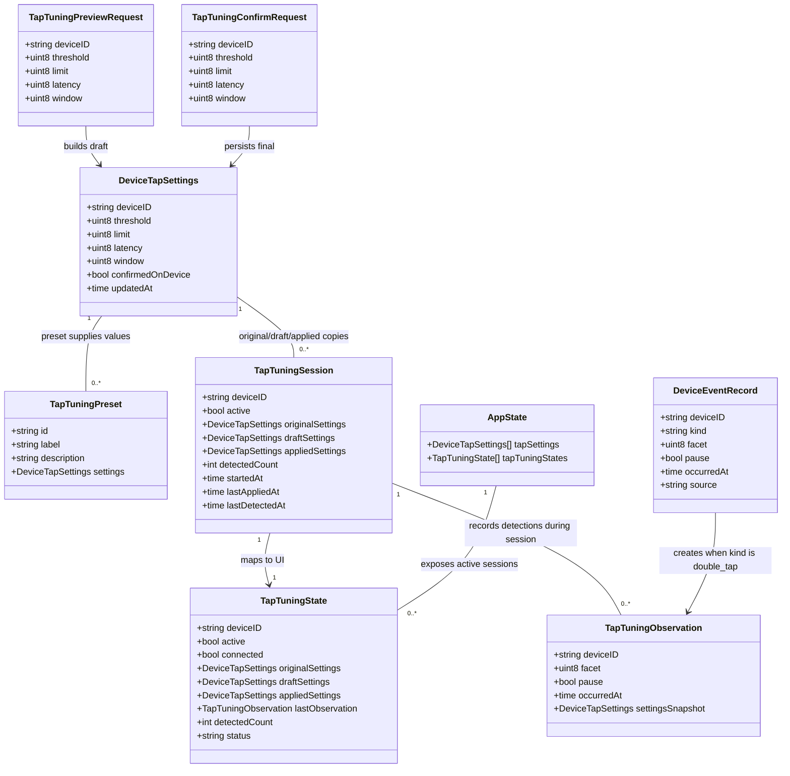

# Interactive Double-Tap Tuning

## Requirements
Implement an interactive TimeFlip2 double-tap tuning workflow that lets a user safely adjust, test, compare, cancel, and persist accelerometer tap settings while receiving live feedback from real double-tap events.

Create a user-facing tuning surface that turns the existing raw `threshold`, `limit`, `latency`, and `window` register values into an iterative calibration loop with presets, sliders, live event detection, save/cancel controls, and clear connection/confirmation status.

Preserve the existing `DeviceTapSettings` persistence model, device write path, Wails controller boundary, and `timeflip-go` integration. Add only the state and DTOs required for a temporary tuning session; do not create a new database table unless implementation proves existing storage cannot represent final settings.

Limit this feature to connected TimeFlip2 devices with an active event stream. Offline editing may update draft form state in the UI, but preview testing and live detection require a connected and authorized device.

## Entities

## Approach
1. Interactive Calibration Workflow:
   - Add a tuning mode to the existing Tap Settings panel rather than replacing the simple save form.
   - Let users start tuning for the selected device, choose a preset, adjust four byte-range controls, apply settings temporarily to the connected device, perform physical double taps, and see immediate detection feedback.
   - Keep final persistence explicit: preview writes are temporary device writes, while confirmation uses the existing `ConfigureTapSettings` path so the stored setting remains the source of truth.

2. Backend Session Orchestration:
   - Add in-memory tuning session state to `DeviceService`, keyed by device ID, containing original settings, latest draft, latest applied values, and detection counters.
   - Extend the Wails controller with `BeginTapTuning`, `PreviewTapTuningSettings`, `ConfirmTapTuningSettings`, `CancelTapTuning`, and `ListTapTuningPresets`.
   - During the existing event-stream loop, publish a tuning-specific event when `DeviceEventRecord.Kind == "double_tap"` and a tuning session is active for that device.
   - Do not intercept or suppress the normal tracking path; tuning feedback observes the same event stream while tracking continues to receive events.

3. Frontend Experience:
   - Upgrade the Tap Settings panel into a compact calibration tool with presets, sliders/numeric inputs, apply/test/save/cancel controls, and a live detection readout.
   - Use existing Wails event subscription patterns so the UI updates on `device.tap.tuning.state`, `device.tap.tuning.detected`, `device.tap.saved`, and `device.configuration.unconfirmed`.
   - Make controls resilient: disable preview/testing when no device is selected or the device is not connected, preserve drafts while switching presets, and show confirmed/saved/temporary status clearly.

4. Validation and Error Handling:
   - Reuse `DeviceTapSettings` and add byte-range validation in Go even though the frontend already clamps values.
   - Return existing domain `ValidationError` and device errors with safe messages through the current `AppError` pattern.
   - On preview failure, keep the draft visible, mark the settings as not confirmed, and publish an unconfirmed configuration event.
   - On cancel, attempt to restore the original settings to the connected device; if restore fails, report the restore error without deleting the stored final setting.

## Structure

### Inheritance Relationships
1. `device.Client` interface continues to define `SetTapSettings`; no new hardware abstraction is required.
2. `TimeflipDeviceClient` continues to implement tap writes by delegating to `timeflip-go` `Session.SetTapSettings`.
3. `Store` continues to persist final `DeviceTapSettings`; tuning sessions remain in memory inside `DeviceService`.
4. `Controller` exposes Wails methods that delegate tuning commands to `DeviceService`.
5. `MemoryEventBus` and the Wails event bus continue to publish state changes; add tuning event names without changing the bus interface.
6. `ValidationError` continues to wrap invalid tap settings; do not add a new exception hierarchy.

### Dependencies
1. Frontend Tap Settings UI calls `Controller.BeginTapTuning`, `PreviewTapTuningSettings`, `ConfirmTapTuningSettings`, `CancelTapTuning`, and `ListTapTuningPresets`.
2. `Controller` depends on `DeviceService` for all tuning operations.
3. `DeviceService` depends on `Store`, `device.Client`, `EventBus`, `Clock`, active device handles, and the existing event stream.
4. `DeviceService` uses `Store.GetDeviceTapSettings` and `domain.DefaultDeviceTapSettings` to establish original settings.
5. `DeviceService` uses `device.Client.SetTapSettings` for preview, confirm, restore, and reconnect reapply behaviour.
6. `TrackingService` continues to process `double_tap` events; tuning only observes events by publishing additional tuning feedback.
7. Frontend formatting helpers convert backend tap settings into editable byte fields and preset selections.
8. Tests depend on existing fake device clients, memory stores, and event buses, extended with tuning cases.

### Layered Architecture
1. Desktop Shell Layer: Wails runtime subscriptions carry tuning events to the React frontend.
2. Controller/API Layer: Wails-exposed Go methods validate request shape and delegate to services.
3. Application Service Layer: `DeviceService` owns temporary tuning sessions, preview writes, confirm/cancel flow, and tuning event publication.
4. Domain Layer: `DeviceTapSettings`, tuning DTOs, presets, and validation rules define the business model.
5. Device Integration Layer: `device.Client` and `TimeflipDeviceClient` write tap register values through `timeflip-go`.
6. Persistence Layer: SQLite stores only confirmed/final `DeviceTapSettings`; temporary drafts are not persisted.
7. Frontend Layer: React renders interactive controls, live feedback, and status transitions using existing app state and Wails bindings.

## Operations

### Update Domain Models - Tap Tuning DTOs
1. Responsibility: Represent temporary double-tap tuning state without changing the final persisted settings model.
2. Attributes:
   - `TapTuningPreset.ID`: `string` - stable preset identifier such as `balanced`, `sensitive`, `deliberate`.
   - `TapTuningPreset.Label`: `string` - short UI label.
   - `TapTuningPreset.Description`: `string` - concise explanation of intended feel.
   - `TapTuningPreset.Settings`: `DeviceTapSettings` - register values with the target device ID filled when returned.
   - `TapTuningSession.DeviceID`: `string` - selected device.
   - `TapTuningSession.OriginalSettings`: `DeviceTapSettings` - stored or device-read settings captured when tuning starts.
   - `TapTuningSession.DraftSettings`: `DeviceTapSettings` - current UI draft.
   - `TapTuningSession.AppliedSettings`: `DeviceTapSettings` - latest values written temporarily to the device.
   - `TapTuningSession.DetectedCount`: `int` - number of double-tap observations during this session.
   - `TapTuningObservation`: device ID, facet, pause flag, occurrence time, and settings snapshot.
3. Methods:
   - `func DefaultTapTuningPresets(deviceID string) []TapTuningPreset`
     - Logic:
       - Return three presets: balanced uses existing defaults `20/10/5/30`; sensitive lowers threshold and shortens timing values modestly; deliberate raises threshold and widens timing values.
       - Use byte values only and fill `DeviceID` for each preset.
   - `func ValidateDeviceTapSettings(settings DeviceTapSettings) error`
     - Logic:
       - Keep existing required device ID validation.
       - Explicitly validate `threshold`, `limit`, `latency`, and `window` as byte register values. Because the type is `uint8`, this mostly protects future DTO conversion and documents the hardware boundary.
4. Constraints:
   - Do not add a persistent table for tuning sessions.
   - Do not remove or rename fields on `DeviceTapSettings`.

### Implement Service Flow - DeviceService Tap Tuning
1. Interface Definition:
   - `BeginTapTuning(ctx context.Context, deviceID string) (domain.TapTuningState, error)`
   - `PreviewTapTuningSettings(ctx context.Context, settings domain.DeviceTapSettings) (domain.TapTuningState, error)`
   - `ConfirmTapTuningSettings(ctx context.Context, settings domain.DeviceTapSettings) (domain.DeviceTapSettings, error)`
   - `CancelTapTuning(ctx context.Context, deviceID string) (domain.TapTuningState, error)`
   - `ListTapTuningPresets(deviceID string) []domain.TapTuningPreset`
2. Core Methods:
   - `BeginTapTuning`
     - Input Validation: require non-empty device ID and a connected/authorizable handle through `ensureHandle`.
     - Business Logic: load stored settings; if not found, use `DefaultDeviceTapSettings(deviceID)`; capture original and draft; start event stream if needed; publish `device.tap.tuning.state`.
     - Exception Handling: return validation errors for missing device ID and mapped device errors for connection/authorization failure.
     - Return Value: active `TapTuningState`.
   - `PreviewTapTuningSettings`
     - Input Validation: require active tuning session, matching device ID, and valid byte settings.
     - Business Logic: write settings to device with `writeTapSettings`; update draft/applied settings and `lastAppliedAt`; do not save to SQLite; publish `device.tap.tuning.state`.
     - Exception Handling: publish `device.configuration.unconfirmed` and keep the draft when the write fails.
     - Return Value: active state showing temporary/applied status.
   - `ConfirmTapTuningSettings`
     - Input Validation: require active tuning session and valid settings.
     - Business Logic: call existing `ConfigureTapSettings`; mark session inactive; publish `device.tap.saved` through existing path plus final tuning state.
     - Exception Handling: preserve active session if confirmation fails so the user can retry or cancel.
     - Return Value: confirmed `DeviceTapSettings`.
   - `CancelTapTuning`
     - Input Validation: require device ID; return inactive state if no session exists.
     - Business Logic: if connected, write original settings back to the device; leave SQLite unchanged; clear session; publish final inactive tuning state.
     - Exception Handling: if restore fails, return the error while keeping stored settings untouched and publish `device.configuration.unconfirmed`.
3. Dependency Injection:
   - Reuse existing `DeviceService` dependencies: `store`, `client`, `bus`, `clock`, and handle maps.
   - Add a `tapTuning map[string]domain.TapTuningSession` protected by the existing service mutex or a small dedicated mutex.
4. Transaction Management:
   - No transaction is required for preview because it is not persisted.
   - Confirm uses the existing `ConfigureTapSettings` persistence sequence.

### Extend Event Handling - Live Double-Tap Feedback
1. Responsibility: Convert real double-tap events into calibration feedback without disturbing tracking.
2. Methods:
   - `func (s *DeviceService) publishTapTuningObservation(ctx context.Context, event domain.DeviceEventRecord)`
     - Logic:
       - Return immediately unless `event.Kind == "double_tap"`.
       - Find an active tuning session for `event.DeviceID`.
       - Increment `DetectedCount`, set `LastDetectedAt`, snapshot the currently applied settings, and publish `device.tap.tuning.detected`.
       - Publish updated `device.tap.tuning.state`.
   - Modify `startEventStream`
     - Logic:
       - After `shouldIgnoreDeviceEvent` returns false and before or after `TrackingService.ApplyDeviceEvent`, call `publishTapTuningObservation`.
       - Continue calling tracking for every event, including double taps.
3. Constraints:
   - Tuning feedback must not block the event loop with long UI work.
   - Observation publication must tolerate missing sessions and not return errors into the stream loop.

### Update Controller and Wails Bindings - Tuning API
1. Responsibility: Expose tuning commands to the frontend and regenerate bindings.
2. Methods:
   - `func (c *Controller) BeginTapTuning(deviceID string) (domain.TapTuningState, error)`
   - `func (c *Controller) PreviewTapTuningSettings(settings domain.DeviceTapSettings) (domain.TapTuningState, error)`
   - `func (c *Controller) ConfirmTapTuningSettings(settings domain.DeviceTapSettings) (domain.DeviceTapSettings, error)`
   - `func (c *Controller) CancelTapTuning(deviceID string) (domain.TapTuningState, error)`
   - `func (c *Controller) ListTapTuningPresets(deviceID string) []domain.TapTuningPreset`
3. Logic:
   - Delegate directly to `DeviceService`.
   - Keep method names clear in generated Wails bindings.
   - Update `services.AppState` to include active `TapTuningStates` only if the frontend needs reload recovery inside one app process.
4. Verification:
   - Run Wails binding generation so frontend imports compile.

### Update Frontend Formatting - Tap Tuning Helpers
1. Responsibility: Support ergonomic editing and preset application.
2. Methods:
   - `tapSettingsToForm(settings, deviceID)` remains the canonical backend-to-form mapper.
   - `tapPresetToForm(preset, deviceID)` returns a form object using preset values and the selected device ID.
   - `tapFormToSettings(form, deviceID)` clamps all four registers with `byteValue`.
   - `tapTuningStatus(state, selectedTapSettings)` returns labels for `defaults`, `temporary`, `saved locally`, `confirmed on device`, and `restore needed`.
3. Constraints:
   - Keep helper functions pure and covered by unit tests.
   - Do not encode device-side register math in the UI beyond labels and value ranges.

### Build Frontend UI - Interactive Tap Settings Panel
1. Responsibility: Replace the raw-only panel with a feature-complete calibration tool.
2. UI Behaviour:
   - Show current selected device, connection state, saved/confirmed status, active tuning status, and last double-tap detection.
   - Provide preset controls for balanced, sensitive, and deliberate values.
   - Use sliders plus numeric byte inputs for `threshold`, `limit`, `latency`, and `window`, with stable dimensions and no layout shift.
   - Provide buttons with icons for Start, Apply to Device, Save, Cancel, and Reset to Saved.
   - Disable Apply and Start when the selected device is missing or not connected.
   - While tuning is active, count detected double taps and show the facet and time of the latest detection.
3. Event Handling:
   - Subscribe to `device.tap.tuning.state` to update active state.
   - Subscribe to `device.tap.tuning.detected` to update live feedback.
   - Subscribe to `device.tap.saved` to reset dirty state after confirmation.
4. Constraints:
   - Keep the UI inside the existing app shell and panel patterns.
   - Do not add marketing/explanatory sections.
   - Use existing styling tokens and lucide icons already used by the app.

### Add Tests - Backend and Frontend
1. Backend Tests:
   - `TestBeginTapTuningUsesStoredSettingsOrDefaults`
   - `TestPreviewTapTuningWritesDeviceWithoutPersisting`
   - `TestConfirmTapTuningPersistsAndEndsSession`
   - `TestCancelTapTuningRestoresOriginalWithoutChangingStore`
   - `TestDoubleTapEventPublishesTuningObservation`
   - `TestPreviewTapTuningRequiresActiveSession`
2. Frontend Tests:
   - Preset-to-form mapping preserves selected device ID.
   - Form-to-settings clamps all register values to `0..255`.
   - Tuning status helper distinguishes temporary, saved, confirmed, and defaults states.
3. Verification Commands:
   - Run focused Go tests for domain, device service, and controller changes.
   - Run frontend unit tests.
   - Run Wails generation if controller/domain bindings change.

## Norms
1. Go API Standards: Use exported controller methods only when they are intended for Wails. Keep service helpers unexported unless tests require package-level access through public behaviour.
2. State Ownership: Persist only final `DeviceTapSettings`; store temporary tuning session state in memory and publish it through events.
3. Error Handling: Return existing `domain.AppError`-wrapped validation and device errors. Publish unconfirmed configuration events when a device write fails after a draft was attempted.
4. Data Validation: Treat all four tap registers as byte values. Frontend clamps for ergonomics; Go validation remains authoritative.
5. Event Publication: Use existing `EventBus.Publish(ctx, name, payload)` and event names under `device.tap.tuning.*`.
6. Frontend Style: Follow current React component patterns, existing panel/grid styles, and lucide-react icons. Keep controls compact, readable, and stable on mobile and desktop.
7. Testing: Cover service state transitions and frontend formatting helpers. Use fake clients and memory event buses instead of real BLE hardware.
8. Documentation: Update user-facing project notes only if implementation introduces manual hardware testing steps not already captured.

## Safeguards
1. Functional Constraints: A user can start tuning only with a selected, connected device; preview writes must not persist; save must persist and confirm through the existing settings path; cancel must attempt to restore original device settings.
2. Performance Constraints: Double-tap observations must publish in constant time and must not block the device event stream. Preview writes must use the existing command timeout behaviour.
3. Security Constraints: Do not log TimeFlip passwords, BLE payloads, or trace data from tuning unless the existing explicit BLE trace option is enabled.
4. Integration Constraints: Continue using `timeflip-go` `SetTapSettings`; do not duplicate BLE command encoding in the desktop app.
5. Business Rule Constraints: Final tap settings remain per-device. Tuning one device must not change another device's draft, session, or stored values.
6. Exception Handling Constraints: Validation errors must provide safe user messages; device write errors must leave stored settings unchanged unless confirmation had already succeeded.
7. Technical Constraints: Do not introduce a new database table for temporary tuning state. Do not change `DeviceTapSettings` JSON field names because existing bindings and UI state depend on them.
8. Data Constraints: `threshold`, `limit`, `latency`, and `window` must remain within `0..255`; `deviceID` must be non-empty for service calls.
9. API Constraints: Wails methods must return serializable domain DTOs and must not expose device handles, channels, mutexes, or raw BLE session types.
10. Recovery Constraints: If cancel restore fails, preserve the session state or publish a clear restore-needed state so the user can retry save/cancel rather than silently losing track of the temporary device configuration.
