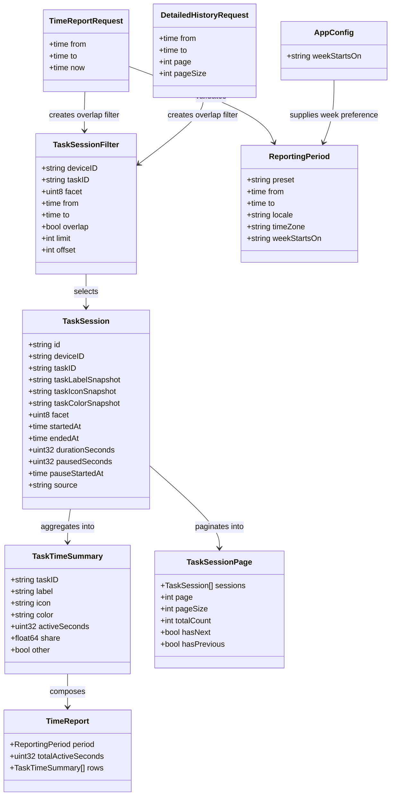

# Time Summary Reporting

## Requirements
Implement a live local time-summary reporting experience for the Track view that answers how much active time was spent per task across all devices for user-selected calendar periods.

Create query-derived task summaries for today, yesterday, this week, this month, and custom date/time ranges, using stored task-session snapshots as the source of truth and preserving historical labels, icons, and colors.

Support boundary-clipped reporting, paused-time exclusion, locale and daylight-saving-aware calendar periods, low-volume task grouping into "Other", concise inline history, and a paginated detailed-history dialog without adding stored aggregate tables, export features, or historical editing.

## Entities

## Approach
1. Reporting service model:
   - Extend the existing history boundary rather than introducing a separate persistence source.
   - Derive reports from `task_sessions` at request time and keep `TaskSession` snapshots as the display source for historical labels, icons, and colors.
   - Add small domain/request/response types for reports and detailed-history pages while preserving existing `TaskSession` behavior for current callers.

2. Period and overlap semantics:
   - Treat report periods as half-open intervals: sessions contribute when they overlap `[from, to)`.
   - Clip each session's elapsed contribution to the selected period before subtracting paused time.
   - Reject missing, zero-length, or inverted custom periods with the same domain validation style used elsewhere.
   - Build preset period windows in the frontend using the user's locale and timezone, then send concrete instants to Go. Use app week-start preference when present, otherwise use locale default.
   - Use calendar arithmetic for days, weeks, and months so daylight-saving changes produce correct local boundaries instead of fixed 24-hour assumptions.

3. Active-time calculation:
   - For closed sessions fully inside a period, active time is duration minus stored paused seconds.
   - For closed sessions partially overlapping a period, clip elapsed time exactly and prorate stored paused seconds by overlap ratio because historical pause intervals are not stored.
   - For open sessions, calculate elapsed time against request `now`; subtract stored paused seconds and subtract the exact open-pause overlap when `pauseStartedAt` is present.
   - Clamp active seconds at zero for all sessions.

4. Summary presentation:
   - Aggregate by historical task identity using session task ID and snapshot fields.
   - Sort visible rows by active time descending.
   - Group tasks below 1.5% of total active time into a visible "Other" row so report totals remain explainable.
   - Use proportional bars based on the largest visible active-time row.
   - Use compact duration labels: seconds for sub-minute totals, minutes for sub-hour totals, hours plus minutes for same-day totals, and days plus hours for multi-day totals.

5. Detailed history:
   - Keep the inline Track history concise by showing the recent subset already used in the UI.
   - Add a dialog that filters detailed sessions by overlapping date/time range and paginates at 20 entries per page.
   - Show an indication when a detailed row starts before or ends after the selected range so overlap filtering is clear.

6. Testing and verification:
   - Cover report period validation, overlap filtering, active-time aggregation, paused-time exclusion, threshold grouping, empty periods, live open sessions, and detailed-history paging with Go tests.
   - Cover preset/custom period helpers, compact duration labels, custom validation, "Other" grouping, and UI helper behavior with frontend tests.
   - Run Go tests with `OBJC_DISABLE_INITIALIZE_FORK_SAFETY=YES` and run frontend node tests after implementation.

## Structure

### Inheritance Relationships
1. `store.Store` remains the persistence interface and gains session-count or paginated session support needed by detailed history.
2. `store.SQLiteStore` implements the extended `store.Store` session filtering and counting behavior.
3. `services.HistoryService` remains the service boundary for history and gains report and paginated history methods.
4. `app.Controller` exposes new Wails-callable methods that delegate to `HistoryService`.
5. React Track view consumes generated Wails bindings and frontend helper functions for periods, formatting, and summary presentation.

### Dependencies
1. `frontend/src/main.jsx` calls controller methods for time reports and detailed-history pages.
2. `frontend/src/timeflip-format.js` owns pure formatting, period, and validation helpers used by the Track view and tests.
3. `internal/app/controller.go` calls `services.HistoryService`.
4. `internal/services/history.go` calls `store.Store` and uses a clock-equivalent `now` value supplied through request input for deterministic reporting.
5. `internal/store/sqlite.go` reads `task_sessions` and applies overlap, sort, limit, offset, and count behavior.
6. `frontend/bindings/...` are regenerated from exported controller/domain types after Go API changes.

### Layered Architecture
1. Domain Layer: report request/response types, period validation helpers, and active-time calculation concepts.
2. Store Layer: SQLite-backed overlapping session selection and paginated count support.
3. Service Layer: business aggregation, "Other" grouping, active-time math, detailed-history paging, and validation.
4. Controller Layer: Wails-safe methods that expose reports and detailed-history pages to React.
5. Frontend Helper Layer: locale-aware period construction, compact duration formatting, form validation, and display grouping helpers.
6. Frontend UI Layer: Track page report controls, summary rows, empty state, concise inline history, and detailed-history dialog.
7. Test Layer: Go service/store/domain tests plus frontend node tests for pure helpers.

## Operations

### Update Domain Types - Reporting and History Contracts
1. Responsibility: define stable request/response types for time reports and detailed-history pagination.
2. Add types in `internal/domain/types.go`:
   - `ReportingPeriod`: `Preset string`, `From time.Time`, `To time.Time`, `Locale string`, `TimeZone string`, `WeekStartsOn string`.
   - `TimeReportRequest`: `From *time.Time`, `To *time.Time`, `Now *time.Time`.
   - `TaskTimeSummary`: `TaskID string`, `Label string`, `Icon string`, `Color string`, `ActiveSeconds uint32`, `Share float64`, `Other bool`.
   - `TimeReport`: `Period ReportingPeriod`, `TotalActiveSeconds uint32`, `Rows []TaskTimeSummary`.
   - `DetailedHistoryRequest`: `From *time.Time`, `To *time.Time`, `Page int`, `PageSize int`.
   - `TaskSessionPage`: `Sessions []TaskSession`, `Page int`, `PageSize int`, `TotalCount int`, `HasNext bool`, `HasPrevious bool`.
3. Extend `TaskSessionFilter` conservatively:
   - Add `Overlap bool`, `Limit int`, and `Offset int`.
   - Existing callers continue to receive start-time filtering when `Overlap` is false.
4. Add validation helpers in the domain or service layer:
   - `ValidateTimeReportRequest(req TimeReportRequest) (time.Time, time.Time, time.Time, error)`.
   - `ValidateDetailedHistoryRequest(req DetailedHistoryRequest) (time.Time, time.Time, int, int, error)`.
5. Constraints:
   - Treat `[from, to)` as the report and history interval.
   - Reject nil dates, zero times, `from >= to`, negative pages, page sizes below 1, and page sizes above a small internal maximum.
   - Default detailed-history page size to 20.

### Update Store Interface - Overlap Filtering and Count
1. Responsibility: support scoped report/history data access without loading all sessions into frontend app state.
2. Update `internal/store/interface.go`:
   - Keep `ListTaskSessions(context.Context, domain.TaskSessionFilter) ([]domain.TaskSession, error)`.
   - Add `CountTaskSessions(context.Context, domain.TaskSessionFilter) (int, error)`.
3. Update `internal/store/sqlite.go`:
   - When `filter.Overlap` is false, preserve current start-time filter semantics.
   - When `filter.Overlap` is true, include sessions where:
     - no `From`: no lower overlap bound;
     - no `To`: no upper overlap bound;
     - with both bounds, `started_at < to` and `(ended_at IS NULL OR ended_at = '' OR ended_at > from)`.
   - Keep `ORDER BY started_at DESC`.
   - Apply `LIMIT` and `OFFSET` only when provided and valid.
   - Implement `CountTaskSessions` with the same filter conditions and no ordering.
4. Tests:
   - Add SQLite store tests for sessions fully inside, fully outside, starting before the range, ending after the range, fully containing the range, and open sessions.
   - Add tests for limit/offset and count consistency.

### Implement Service Logic - Time Report Aggregation
1. Responsibility: calculate business-correct report totals from overlapping sessions.
2. Add methods to `internal/services/history.go`:
   - `func (s *HistoryService) BuildTimeReport(ctx context.Context, req domain.TimeReportRequest) (domain.TimeReport, error)`.
   - `func (s *HistoryService) ListTaskSessionPage(ctx context.Context, req domain.DetailedHistoryRequest) (domain.TaskSessionPage, error)`.
3. Core `BuildTimeReport` logic:
   - Validate request and resolve `now`.
   - Load sessions with `TaskSessionFilter{From: &from, To: &to, Overlap: true}`.
   - For each session, calculate `activeSecondsForPeriod(session, from, to, now)`.
   - Skip sessions with zero active seconds.
   - Aggregate by task identity using task ID plus snapshot fields so renamed or recolored sessions remain historically coherent.
   - Sum total active seconds.
   - If total is zero, return an empty rows slice and total zero.
   - Split rows into visible rows and minor rows using `< 1.5%` of total active seconds.
   - Group minor rows into `Other` with `Other: true`, a neutral icon and color, and active seconds equal to the minor total.
   - Recompute shares from final rows against total active seconds.
   - Sort final rows by active seconds descending, with `Other` after same-duration named rows.
4. Active-time helper behavior:
   - `sessionEnd := endedAt` for closed sessions, otherwise `now`.
   - `overlapStart := max(session.StartedAt, from)`.
   - `overlapEnd := min(sessionEnd, to)`.
   - If `overlapEnd <= overlapStart`, return zero.
   - `overlapElapsed := overlapEnd - overlapStart`.
   - For fully covered closed sessions, subtract `PausedSeconds`.
   - For partially covered closed sessions, subtract prorated paused seconds using `overlapElapsed / fullElapsed`.
   - For open sessions, subtract stored paused seconds prorated to overlap if needed, then subtract exact overlap of `PauseStartedAt` to `now` when the session is currently paused.
   - Clamp result to zero and round down to whole seconds.
5. Core `ListTaskSessionPage` logic:
   - Validate request and default page/pageSize.
   - Build overlap filter with `Limit: pageSize`, `Offset: page * pageSize`.
   - Load sessions and total count from store.
   - Return `HasNext` and `HasPrevious`.
6. Tests:
   - Single task daily report.
   - Multiple task report sorted by active time.
   - Boundary-spanning session clips to period.
   - Pause exclusion for whole-session and partially overlapping sessions.
   - Empty period returns no rows.
   - Less-than-1.5% tasks roll into "Other".
   - Open session report updates when `Now` changes.
   - Detailed history includes overlapping sessions and paginates at 20.

### Update Controller and Wails Bindings
1. Responsibility: expose report and detailed-history service methods to the frontend.
2. Update `internal/app/controller.go`:
   - Add `func (c *Controller) GetTimeReport(req domain.TimeReportRequest) (domain.TimeReport, error)`.
   - Add `func (c *Controller) ListTaskSessionPage(req domain.DetailedHistoryRequest) (domain.TaskSessionPage, error)`.
   - Keep existing `ListTaskSessions` for compatibility.
3. Regenerate Wails bindings using the repo's existing generation workflow.
4. Constraints:
   - Return existing domain/app error types where validation fails.
   - Do not add stored aggregate tables or app-state aggregate fields.

### Update Frontend Helpers - Periods, Formatting, and Validation
1. Responsibility: keep date/time and formatting logic testable outside the React component.
2. Update `frontend/src/timeflip-format.js`:
   - Add `defaultReportPreset = 'today'`.
   - Add `defaultHistoryPageSize = 20`.
   - Add `reportPeriodForPreset(preset, now, options)`.
   - Add `validateCustomPeriod(fromValue, toValue)`.
   - Add `toControllerPeriodRequest(period, now)`.
   - Add `compactDuration(seconds)`.
   - Add `summaryBarPercent(row, rows)`.
   - Add `historyOverlapLabel(session, from, to)`.
3. Period helper rules:
   - `today`, `yesterday`, `this-week`, and `this-month` use local calendar boundaries.
   - Week start uses app preference when present, otherwise locale default.
   - Use local calendar construction rather than adding fixed seconds so DST transitions are respected.
4. Custom validation rules:
   - Reject missing values.
   - Reject invalid date values.
   - Reject `from >= to`.
   - Leave the previous valid report state unchanged after rejection.
5. Tests in `frontend/src/timeflip-format.test.js`:
   - Preset period boundaries for day/week/month.
   - DST-aware day construction around a locale transition when feasible in Node.
   - Custom validation rejects inverted and zero-duration periods.
   - Compact duration labels for seconds, minutes, hours plus minutes, and days plus hours.
   - Summary bar percentages use largest visible row.
   - History overlap labels identify sessions crossing the selected range.

### Update React Track View - Summary Panel and Detailed Dialog
1. Responsibility: provide the user-facing report and detailed-history experience.
2. Update `frontend/src/main.jsx` imports:
   - Import `GetTimeReport` and `ListTaskSessionPage` from generated controller bindings.
   - Import new helper functions from `timeflip-format.js`.
   - Use existing lucide icons where appropriate for report controls, detail dialog, pagination, and refresh.
3. State additions:
   - `reportPreset`, `reportPeriod`, `customPeriodForm`, `report`, `reportError`, `reportLoading`.
   - `historyDialogOpen`, `historyPeriodForm`, `historyPage`, `historyPageData`, `historyLoading`, `historyError`.
4. Live report behavior:
   - Load report when Track view opens and when period changes.
   - Refresh the report on the existing `now` tick while a session is running.
   - Refresh after tracking/session events already handled by the app event subscription.
5. Summary UI:
   - Add report controls above the existing task-session history list.
   - Use segmented preset buttons for today/yesterday/this week/this month/custom.
   - Use date/time inputs for custom period, with apply/cancel behavior.
   - Show rows with `IconBadge`, task label, compact active time, percentage bar using task color, and "Other" row for minor tasks.
   - Show empty state when total active seconds is zero.
   - Show validation errors inline without clearing the previous valid report.
6. Detailed-history dialog:
   - Open from a button near the history section.
   - Use date/time inputs for filter range.
   - Load page 0 on open/apply and use 20 entries per page.
   - Show next/previous pagination controls using `HasNext` and `HasPrevious`.
   - Display overlap hints for sessions that cross the selected range.
7. Layout and accessibility:
   - Keep controls compact and aligned with existing Track view density.
   - Use existing `IconBadge`, session card, button, empty-state, and dialog styling patterns.
   - Do not add a marketing-style page or unrelated visual redesign.

### Update Styles - Report and Dialog Surfaces
1. Responsibility: support the new Track view without disrupting existing pages.
2. Update `frontend/src/styles.css`:
   - Add report panel layout, period controls, summary rows, proportional bars, empty state, and detail dialog styles.
   - Keep cards at or below 8px border radius, matching existing `.session` and `.facet` patterns.
   - Ensure labels and buttons wrap on mobile and do not resize fixed-format controls.
   - Keep the palette balanced with existing task colors and avoid introducing a one-note dominant hue.
3. Responsive constraints:
   - Summary rows should not shift when bars update.
   - Dialog content should scroll internally when history pages are long.
   - Date/time fields should fit narrow screens without overlapping actions.

### Update App Configuration - Week Preference
1. Responsibility: support locale-based week defaults with an app preference override.
2. Conservative implementation:
   - Add a `WeekStartsOn string` app config field only if the current config structure can absorb it cleanly.
   - If adding storage is too large for this feature slice, keep the frontend helper ready for the preference and use locale default initially, documenting the app-preference hook in code comments and tests.
3. If persisted:
   - Add SQLite migration column for app config.
   - Update config load/save and frontend settings form.
   - Add validation for accepted values such as `locale`, `monday`, `sunday`, and `saturday`.
4. Constraint:
   - Do not redesign settings beyond what is needed for the week-start preference.

### Verification
1. Run Go tests:
   - `OBJC_DISABLE_INITIALIZE_FORK_SAFETY=YES go test ./internal/domain ./internal/store ./internal/services ./internal/app -count=1`
2. Run frontend tests:
   - `npm --prefix frontend test`
3. Regenerate Wails bindings after controller/domain changes.
4. Run focused manual verification in the app or dev server:
   - Create sample sessions covering one task, multiple tasks, empty period, boundary crossing, paused time, and low-volume "Other".
   - Confirm summary rows, live updates, detailed-history pagination, and overlap hints.

## Norms
1. Go domain types:
   - Keep JSON tags camelCase to match existing Wails frontend models.
   - Use pointers for optional request date fields to distinguish missing values from zero values.
   - Keep new structs in `internal/domain/types.go` unless a local domain file pattern emerges during implementation.

2. Go service logic:
   - Keep business rules in `HistoryService` or small unexported helpers close to it.
   - Use UTC instants for service/store comparisons after frontend calendar periods have been resolved.
   - Treat report intervals as half-open `[from, to)` consistently.
   - Clamp negative or inconsistent active-time calculations to zero.

3. Store logic:
   - Reuse `formatTime`, `parseTime`, `scanSession`, and existing SQLite error wrapping.
   - Keep existing `ListTaskSessions` behavior unless `Overlap` is explicitly set.
   - Avoid stringly divergent filters by sharing filter-building logic between list and count methods where practical.

4. Frontend helpers:
   - Put pure date/time, validation, and duration helpers in `frontend/src/timeflip-format.js` and cover them in `timeflip-format.test.js`.
   - Keep React component state orchestration in `main.jsx`, but avoid burying business math there.
   - Use existing `messageFromError` for controller failures.

5. UI patterns:
   - Use lucide icons already imported or available for buttons.
   - Use segmented buttons for period presets, date/time inputs for custom ranges, and icon buttons or icon+text buttons for clear commands.
   - Keep Track view as the working surface, not a landing page.

6. Testing:
   - Add focused Go tests near the layer being changed.
   - Add frontend node tests for every pure helper that encodes period, validation, grouping, or formatting rules.
   - Run macOS Go tests with `OBJC_DISABLE_INITIALIZE_FORK_SAFETY=YES`.

7. Documentation:
   - Comments should explain only non-obvious decisions, especially pause prorating for historical partial overlaps and DST-aware calendar boundaries.
   - Do not add broad docs unless implementation reveals user-facing behavior that needs explicit project documentation.

## Safeguards
1. Functional constraints:
   - Reports must include all devices by default.
   - Reports must include only sessions overlapping the selected period.
   - Boundary-spanning sessions must contribute only the portion inside the period.
   - Summary rows must use recorded task snapshots, not current task metadata, for historical display.
   - Tasks below 1.5% of total active time must be grouped into "Other".
   - Detailed-history pages must use 20 entries per page.

2. Data constraints:
   - Do not create aggregate tables or cached report rows.
   - Do not edit historical sessions as part of reporting.
   - Preserve existing `TaskSession` fields and storage semantics unless a minimal backward-compatible extension is required.
   - Store and compare instants consistently; resolve local calendar boundaries before requesting backend data.

3. Validation constraints:
   - Reject custom periods where start is missing, end is missing, either value is invalid, start is after end, or start equals end.
   - Keep the previous valid report visible after invalid custom input.
   - Reject invalid pagination values and default page size to 20.

4. Time and timezone constraints:
   - Presets must use locale-aware local calendar boundaries.
   - Week boundaries must use app preference when available and locale default otherwise.
   - Daylight-saving-time transitions must be handled by calendar construction, not fixed-second arithmetic.
   - Report updates for open sessions must use a deterministic `now` value in tests.

5. Active-time constraints:
   - Active time must never be negative.
   - Closed full-overlap sessions subtract stored paused seconds.
   - Closed partial-overlap sessions prorate stored paused seconds because historical pause intervals are not currently stored.
   - Open pause overlap must be subtracted exactly when `pauseStartedAt` is available.

6. UI constraints:
   - The summary panel must sit above detailed task-session history in the Track view.
   - Inline history must remain concise.
   - Detailed history must appear in a dialog with filter and pagination controls.
   - Empty periods must show an explicit empty state.
   - Overlapping detailed-history rows must indicate when the session extends outside the selected range.

7. Performance constraints:
   - Avoid loading all history into frontend state for report and detailed-history operations.
   - Use scoped overlap filters and pagination for detailed history.
   - Keep live report refresh tied to active tracking and relevant session events to avoid unnecessary background churn.

8. Integration constraints:
   - Regenerate Wails bindings after exported controller or domain model changes.
   - Keep existing `GetAppState` and `ListTaskSessions` callers working.
   - Do not change device event import/reconciliation except if a minimal correction is necessary for accurate session boundaries.

9. Quality constraints:
   - Go tests must cover validation, overlap filtering, aggregation, pause exclusion, empty periods, "Other" grouping, and paginated history.
   - Frontend tests must cover period construction, validation, compact duration, and display helper behavior.
   - Implementation must pass repo formatting, linting, and test commands before delivery.
